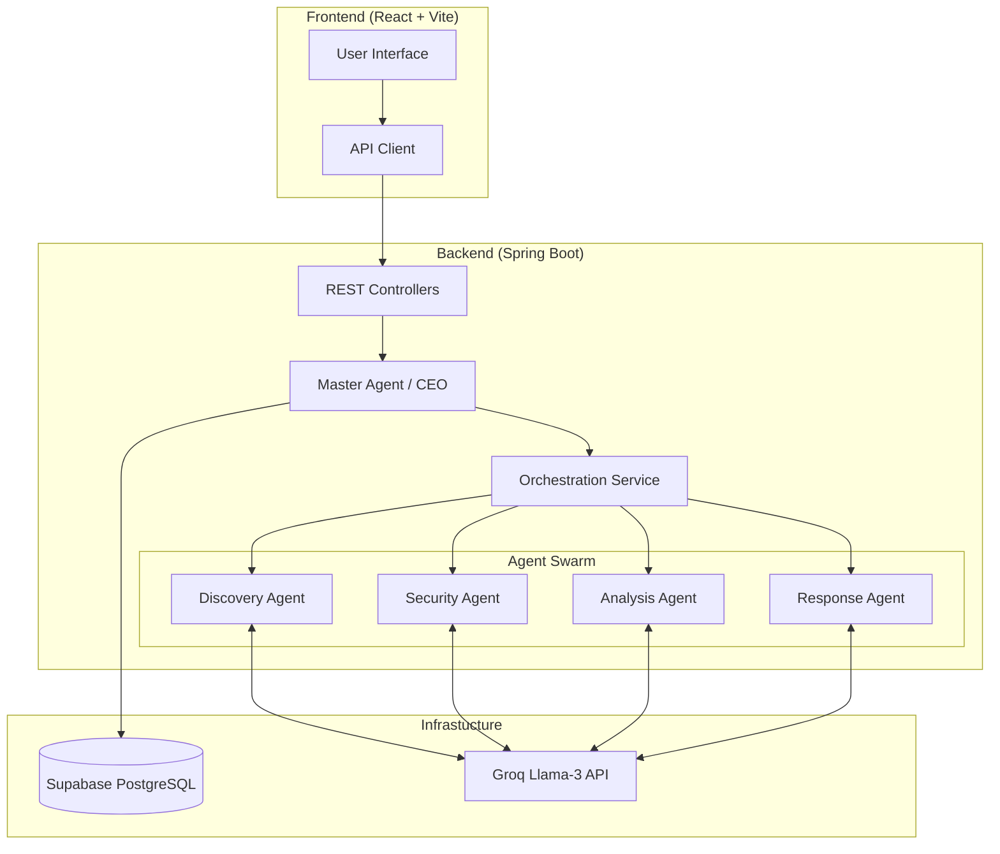
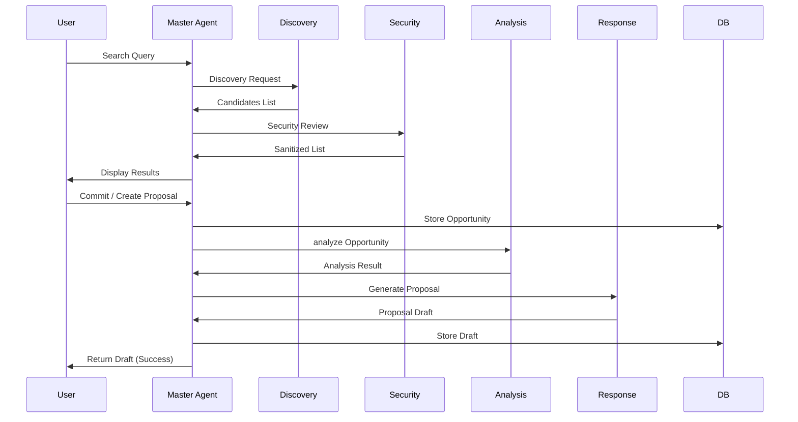

# Chakro AI — Virtual Business Development Partner (VBDP)

  
   
  
  
  
  
  
  
  

---

## 🚀 Overview
**Chakro AI VBDP** is an enterprise-grade AI SaaS platform designed to automate the discovery, security assessment, and technical proposal generation for hackathons and business tenders. By leveraging **Java 25 Virtual Threads** and the **Groq Llama-3** model, Chakro AI provides high-concurrency orchestration of multiple specialized agents.

## 🏗 Architecture

### System Overview

### Agent Orchestration Flow

## 🛠 Tech Stack

### Backend
- **Core**: Java 25 (OpenJDK Temurin)
- **Framework**: Spring Boot 3.5.2
- **Concurrency**: Java Virtual Threads (Project Loom)
- **AI Integration**: LangChain4j, Groq Llama-3 API
- **Persistence**: Supabase (PostgreSQL), Flyway Migrations
- **Security**: Spring Security, JWT, BCrypt

### Frontend
- **Framework**: React 19, Vite 7
- **Styling**: Tailwind CSS 4, Framer Motion
- **UI Components**: Radix UI, Shadcn UI (variants)
- **State/Routing**: Zustand, React Router

## 📊 Performance & Metrics

| Component | Concurrency Model | Avg. Response Time | Optimization |
| :--- | :--- | :--- | :--- |
| **Discovery Agent** | Virtual Threads | ~2.5s (8 URLs) | Parallel Scrapping |
| **Security Agent** | Virtual Threads | ~1.2s | Parallel LLM Validation |
| **Analysis Agent** | Sequential/Async | ~3.0s | Token-optimized Prompts |
| **Response Agent** | Sequential/Async | ~4.5s | Structured Output |
| **Global API** | Non-blocking I/O | < 200ms | Virtual Thread Executor |

### Monitoring
- **Actuator**: Health, Metrics, and Info endpoints.
- **MicroMeter**: Integrated with Prometheus for real-time monitoring.

## 🛡 Security & Best Practices
- **Secret Management**: All sensitive keys (`GROQ_API_KEY`, `JWT_SECRET`) are externalized to environment variables.
- **Commit-Only Logic**: Personal data and opportunities are only persisted upon explicit user command to ensure data privacy and prevent spam.
- **Dependency Audit**: Regular screening for vulnerabilities (CVEs) and utilizing stable LTS versions of core libraries.

---

  Built with ❤️ by the Chakro AI Team.

