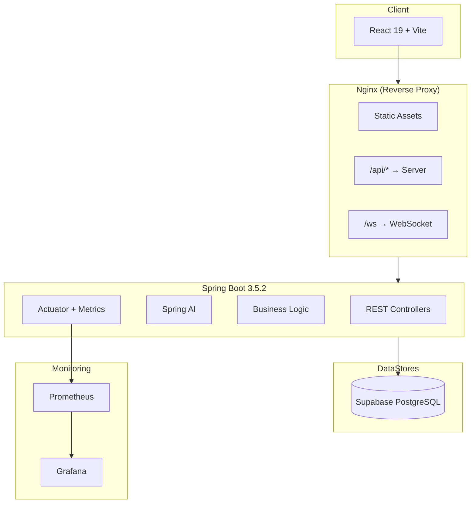

# Architecture

## System Overview

Chakro AI is a monorepo with a Spring Boot backend and React frontend, backed by Supabase (PostgreSQL), and a full observability stack.

## Component Responsibilities

| Component     | Purpose                                                  |
|---------------|----------------------------------------------------------|
| `client/`     | React SPA — UI, routing (TanStack Router), state (Zustand), forms (React Hook Form) |
| `server/`     | Spring Boot API — REST endpoints, AI inference, business logic |
| `deploy/`     | Production infrastructure — Docker Compose, Nginx        |
| `monitoring/` | Observability — Prometheus scraping, Grafana dashboards   |
| `env/`        | Environment config — templates for dev and prod           |

## Data Flow

1. **User** → Nginx (port 80) → serves React SPA
2. **React** → Nginx `/api/*` → reverse proxy → **Spring Boot** (port 8080)
3. **Spring Boot** → Supabase (Data + Persistence)
4. **Spring Boot Actuator** → Prometheus → Grafana (metrics)
5. **WebSocket** → Nginx `/ws` → Spring Boot (STOMP via SockJS)

## Tech Stack Details

- **Spring AI** — AI/ML model integration with vector store (pgvector)
- **Flyway** — Database schema migrations
- **Micrometer** — Metrics instrumentation (Prometheus registry)
- **OpenTelemetry** — Distributed tracing
- **TailwindCSS 4** — Utility-first CSS framework
- **TanStack Query** — Server state management
- **Tiptap** — Rich text editor
